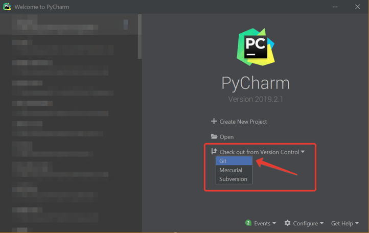
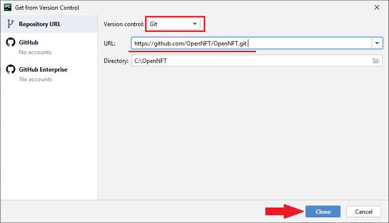
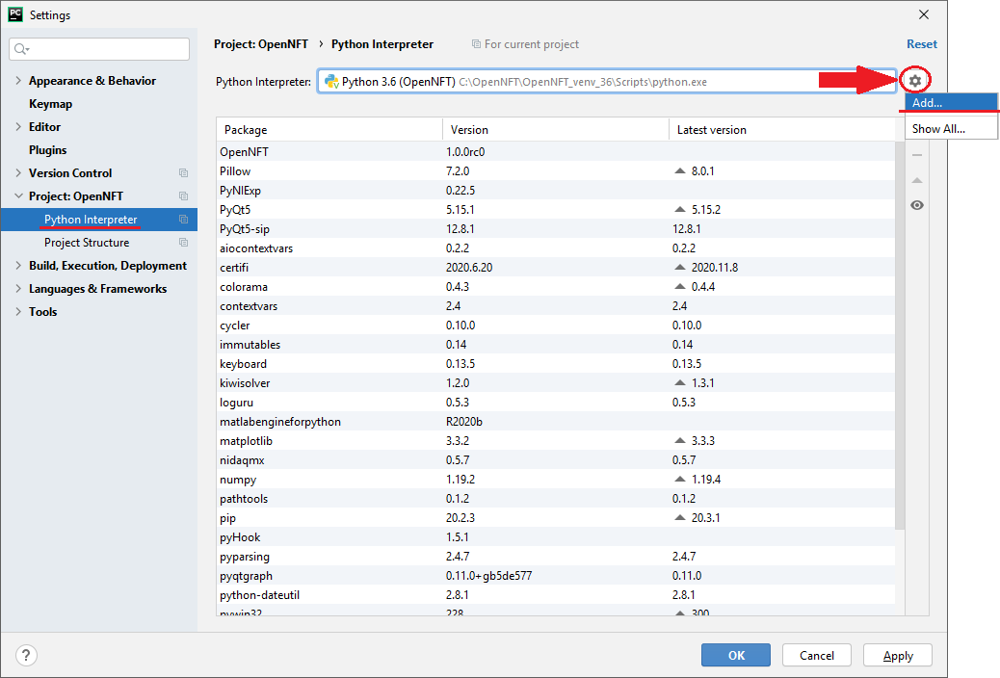
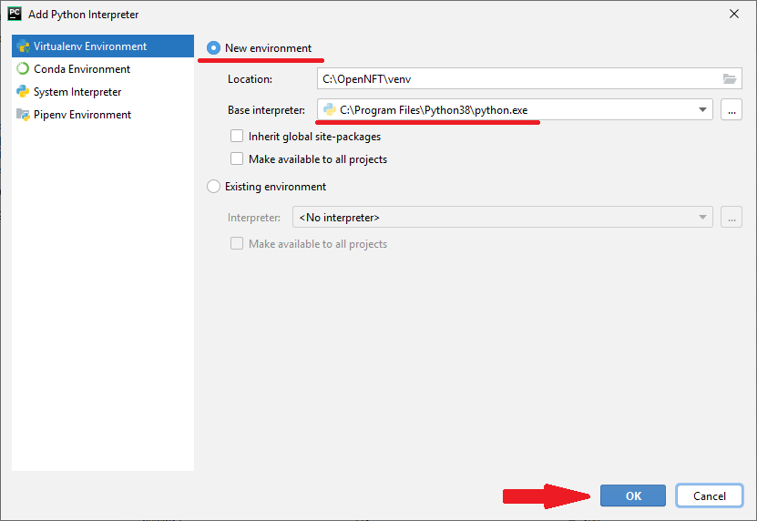
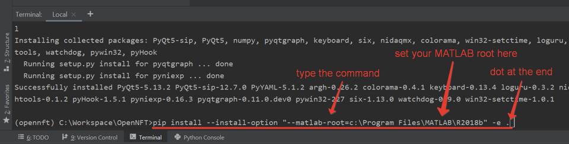
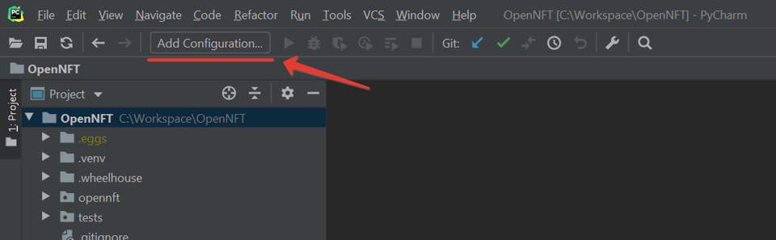
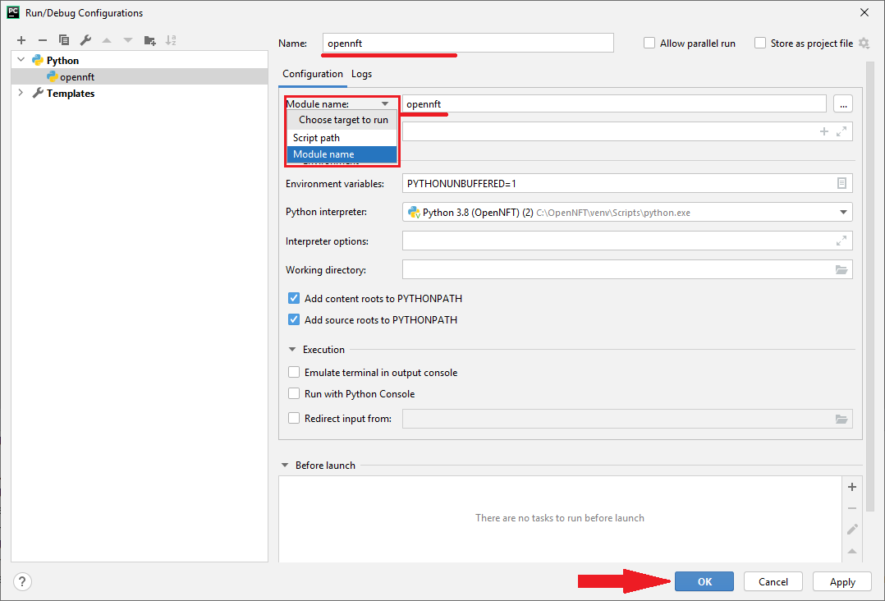
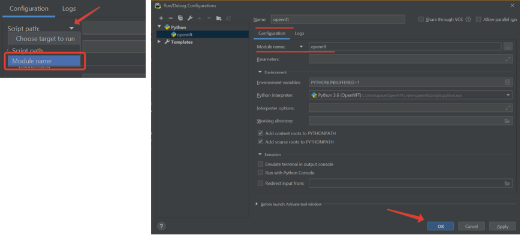
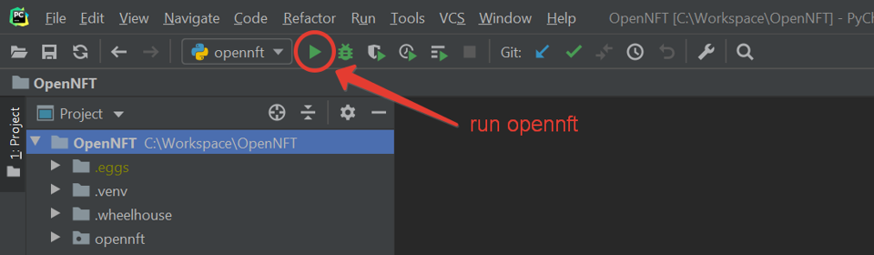

.. _install:

PyCharm based Installation
==========================

The installation process has been tested on three x86_64 platforms:

* Linux (Ubuntu 18.04)
* Mac OS (High Sierra 10.13.6)
* Windows 10

Prerequisites
-------------

Firstly, the following software should be installed:

* `Git <https://git-scm.com/downloads>`_: for installing SPM, Psychtoolbox and OpenNFT
* MATLAB x86_64 R2017b or above
    - Image Processing Toolbox
    - Statistics and Machine Learning Toolbox
    - `SPM12 <https://github.com/spm/spm12>`_
    - `Psychtoolbox 3 <https://github.com/Psychtoolbox-3/Psychtoolbox-3>`_
    - `JSONlab <https://github.com/fangq/jsonlab>`_
    - `prepNFB <https://github.com/lucp88/prepNFB>`_ (optional)
* `Python <https://www.python.org/downloads/>`_ x86_64 3.6.0-3.8.6

Install OpenNFT
---------------

Creating Project by cloning from GitHub repository
++++++++++++++++++++++++++++++++++++++++++++++++++

You can use link of the main repository

.. code-block::

    https://github.com/OpenNFT/OpenNFT.git

Or if you want to contribute to the project - create fork repository and use your link

.. code-block::

    https://github.com/Your_Repository/OpenNFT.git

Creating Virtual Environment
++++++++++++++++++++++++++++

To create virtual environment go to File -> Settings -> Project Interpreter

Setup location of a new virtual envirnment and choose python version

Install from Project Directory
++++++++++++++++++++++++++++++

.. rubric:: Default installation.

MATLAB will be found automatically

.. code-block::

    pip install -U pip setuptools wheel
    pip install -e .

.. rubric:: Customized installation.

If you have several MATLAB versions and you need to specify MATLAB root directory

.. code-block::

    pip install -U pip setuptools wheel
    pip install -U -r requirements.txt

To install ``matlabengineforpython`` you can use one of these methods

.. code-block::

    pip install --install-option "--matlab-root=<MATLABROOT>" -e .

Or

.. code-block::

    cd /Path/To/Matlab/Root/extern/engines/python/
    python build setup.py install
    cd /Path/To/Project/Directory/

Check Installation
------------------

Check the installation before run: :ref:`Installation check`

Run Application
---------------

Before run you need to create Run Configuration

Specify Module name as "opennft" (NOT Script path) and Project interpreter according to your venv

And then press run

