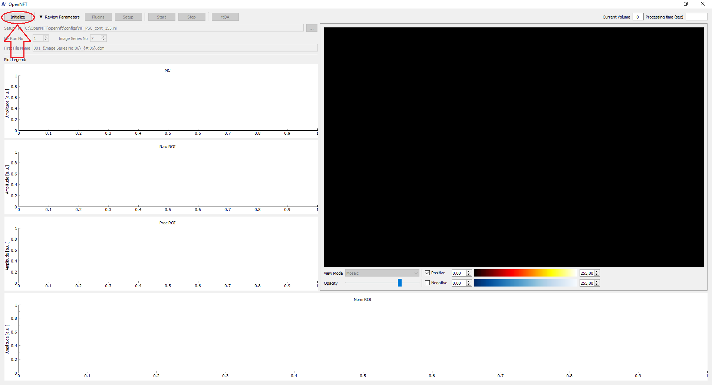
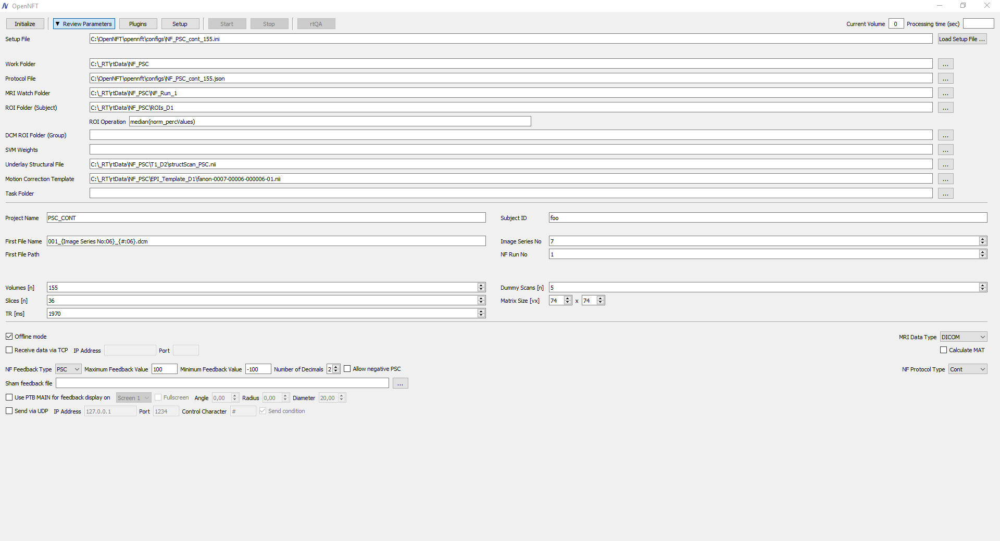
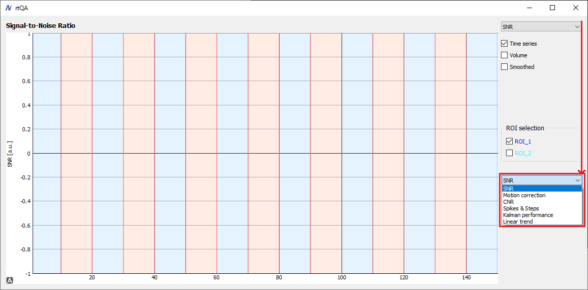
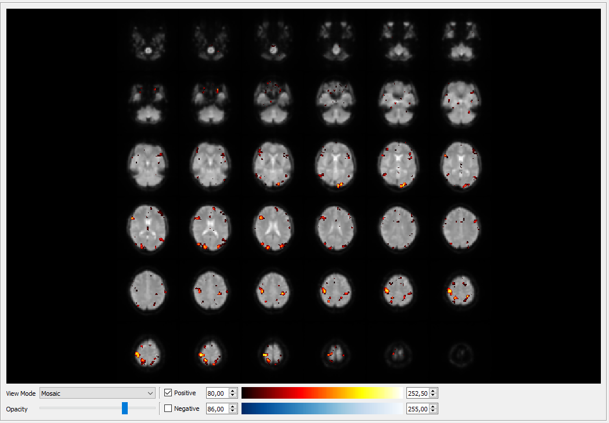

.. _quickstart:

Quickstart
==========

Depending on your project needs, you can disable the following procedures in ``config.py``:

* desktop mode for Matlab sessions, disabled by default (MAIN_MATLAB_STARTUP_OPTIONS, etc. flags)
* real-time quality assessment (USE_RTQA flag)
* incremental GLM (USE_IGLM flag)
* region of interest visualization (USE_ROI flag)
* Matlab helper session for DCM feedback type, disabled by default (USE_MATLAB_MODEL_HELPER flag)

Initialize and/or Run Matlab Sessions
-------------------------------------

There are two ways to run the required MATLAB sessions:

1. By pressing the ``Initialize`` button after running the application via the command :ref:`run_application` or from PyCharm :ref:`run_application_pycharm`.

2. from a Terminal before starting OpenNFT and pressing the ``Initialize`` button:

.. code-block::

    run_matlab

This mode of shared Matlab sessions allows re-using them after closing and re-starting OpenNFT, which is of benefit for software developments and debugging.

.. note::

    If Matlab sessions are started separately, by pressing the ``Initialize`` button, OpenNFT acknowledges them automatically.

Setup
------------------

After the Initialization you can choose the Configuration file (*.ini) of the Experiment. This file contains editable parameters, which you need to justify before pressing the ``Setup`` button.

.. _releases: https://github.com/OpenNFT/OpenNFT_Demo/releases
.. _tutorials: https://github.com/OpenNFT/OpenNFT_VideoTutorials/releases

.. note::

    Configuration files (*.ini) and Experimental protocols (*.json) can be found in /opennft/configs/.
    Demo data can be found releases_.
    Video Tutorials can be found tutorials_. Although Video tutorials were made for an initial upload in 2017 and have somewhat different GUI,
    the general rationale is preserved (updates are pending).

.. note::

    If you run OpenNFT in offline mode - enable ``Offline mode``
    More about testing OpenNFT on different data is on :ref:`testing` page.

If the ``rtQA`` mode button is enabled, you can check available quality assessment modes and parameters during data acquisitions.

Run
---------------

Pressing ``Start`` either start data processing in ``Offline mode``, or waits for fMRI data export from the Scanner otherwise. See tutorials_.

During data acquisitions you can change:

* View Modes: mosaic, triplanar anatomy, triplanar EPI
* Opacity threshold
* Positive and negative statistical maps (not yet available in rtQA mode) and their thresholds

Stop and Exit
--------------------------

To stop scanning process press ``Stop`` button. All data will be saved to /Your/Data/Path/NF_Data_1

After exit, all MATLAB sessions will be terminated if they were not initialized using the ``run_matlab`` command. Otherwise, use 'Crtl+C' in the Terminal to stop them.

