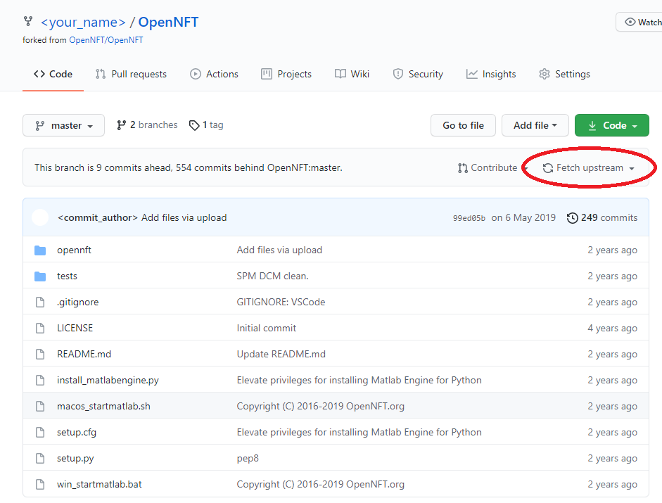
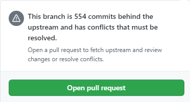
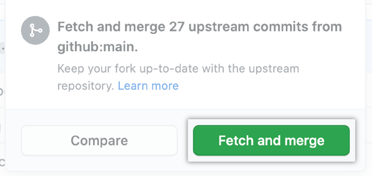
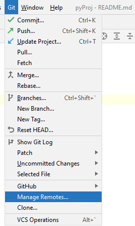
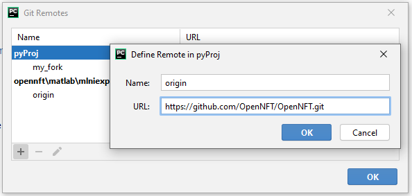
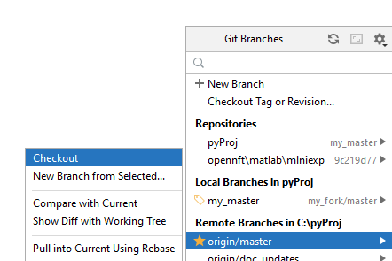
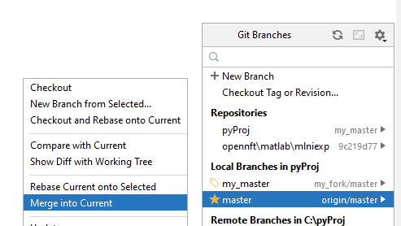
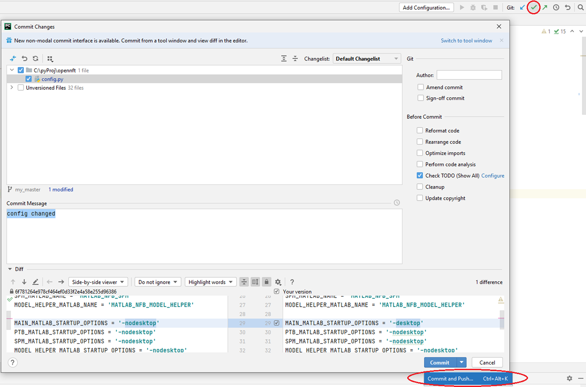
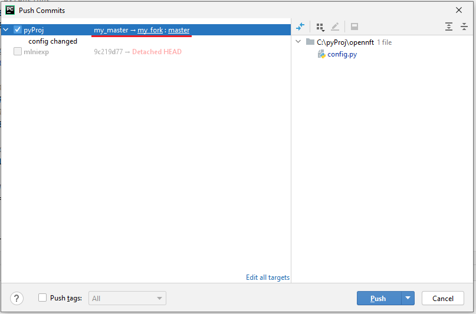

.. _updates_fork:

Updates and Development using Fork
==================================

Update required packages
--------------------------

If you need to upgrade required packages for OpenNFT, use following command in terminal

.. code-block::

    pip install -r requirements.txt --upgrade

If you need to downgrade a specific package due to its unstable work

.. code-block::

    pip install <PACKAGE_NAME>==<VERSION>

Update your Fork from OpenNFT repository
------------------------------------------

If you have your own repository forked from original OpenNFT, you can update it in the following way

Press ''Fetch upstream'' to update your repository. If you are too behind in commits history, you will have to open pull request and resolve all conflicts

Otherwise, if there is no conflicts, you can press ''Fetch and merge'' to update your fork

Resolve conflicts via PyCharm
-------------------------------

In case if you faced conflicts which you can not resolve using GitHub, you can do following steps to resolve them manually

1. Go to Git -> Manage remotes and add OpenNFT original repository as remote branch

2. Use Git menu in the bottom right part of your screen to checkout to master branch of original OpenNFT

3. Return to your master branch and using the same Git menu press "Merge into current" on original master branch

After that you will be able to resolve all conflicts manually and push all changes to your fork.

Push changes from your local repository to GitHub
----------------------------------------------------

When you completed changes in your local repository, you can share them via commit and push.

1. Press ''Ctrl+K'' or green check mark on the top menu of PyCharm
2. Check necessary files, which you want to commit, and fill commit message field
3. You can push your commit from that window, by pushing green arrow (to the right of check mark) or pressing ‘’Ctrl+Shift+K’’ after commit is done.

4. Make sure that destination of your push is correct ( <local_repository_name> -> <remote_repository_name:branch_name> ). You can check remote repository name and URL in Git -> Manage remotes menu.

Finally, if push succeeded, you will see it in you GitHub repository.

However, if you have troubles when pushing to your fork, check these :ref:`settings <fork_problem>`.

Check pull requests locally
------------------------------

Following command in terminal will help if you want to check pull request to your fork locally

.. code-block::

    git fetch origin pull/<ID>/head:<BRANCHNAME>
    git checkout <BRANCHNAME>

